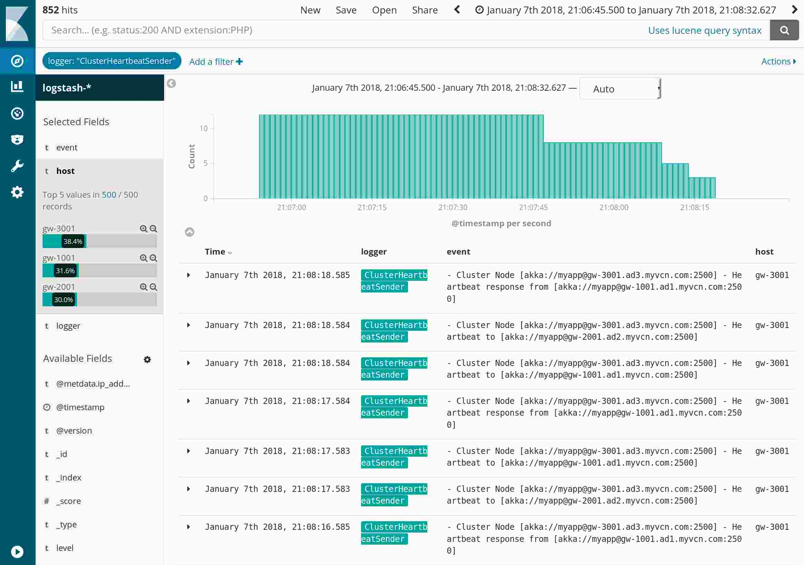
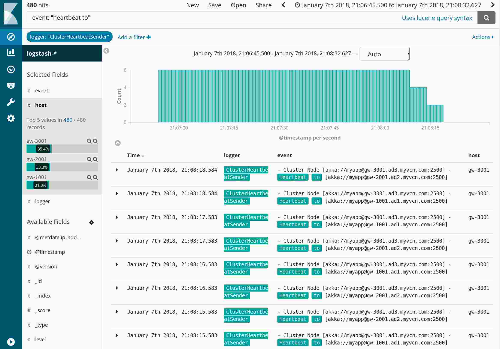
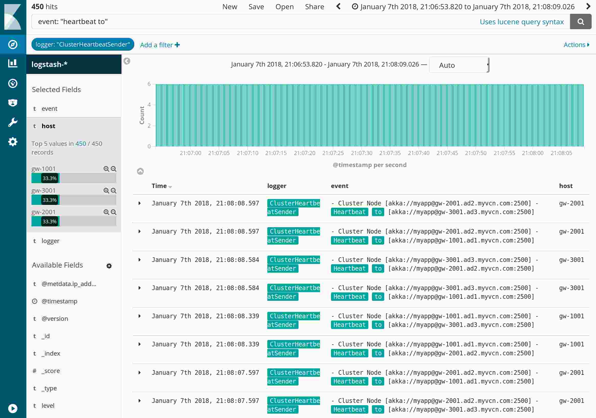
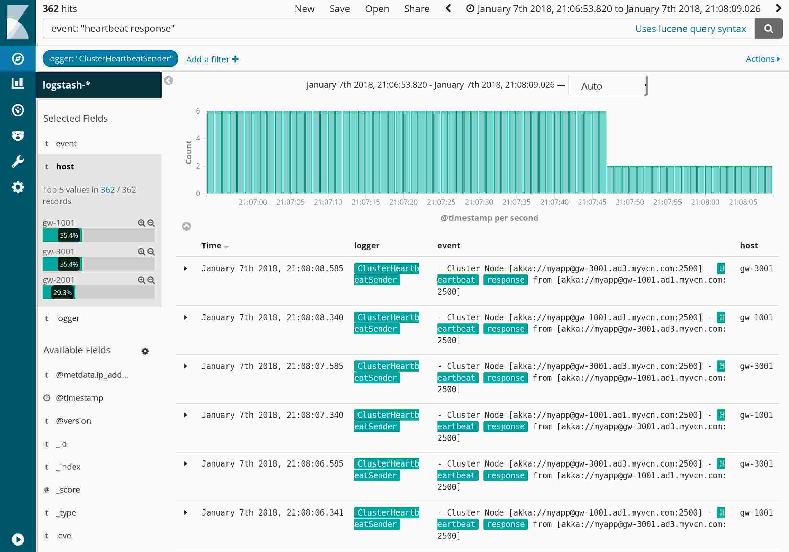
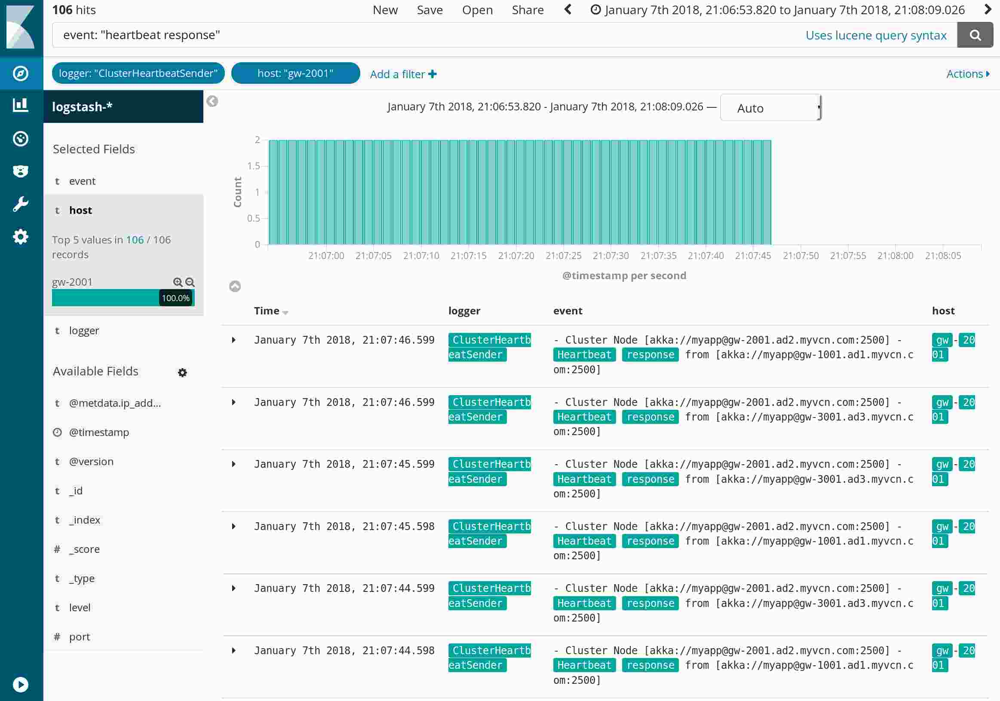
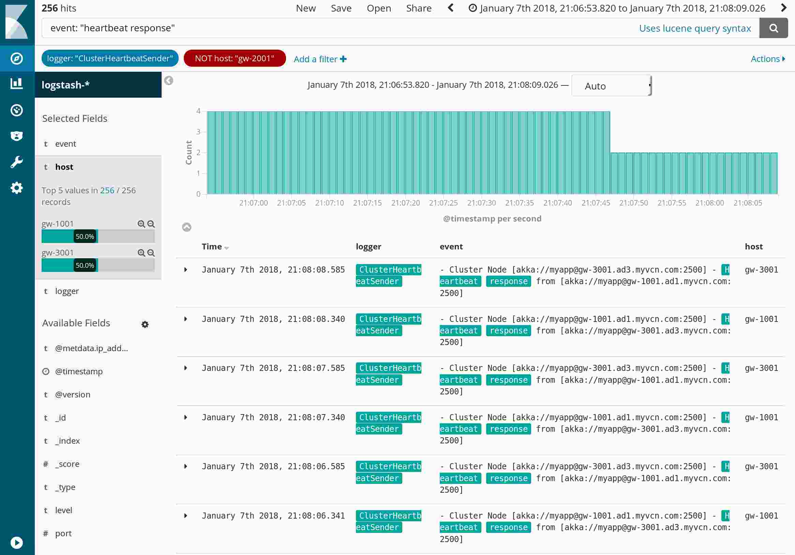
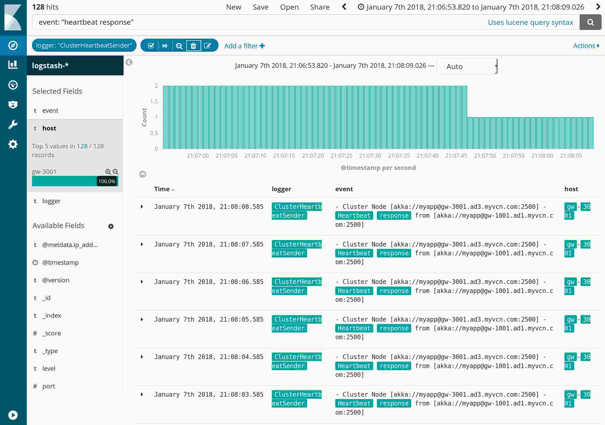

To view logs in Kibana:

* Get docker-elk: `git clone git@github.com:deviantony/docker-elk`
* Add to `logstash/pipeline/logstash.conf`: 

```
input {
        tcp {
                port => 5000
                codec => json
        }
}
```

* Start kibana: `docker-compose up`
* Convert the logging to json (`sbt run`)
* Post it to Kibana: `nc localhost 5000 < out.logs`
* Go to http://localhost:5601/app/kibana#/management/kibana/index
* Choose pattern `logstash-*`, Time Filter field name `@timestamp`
* Browse and filter the logs at http://localhost:5601/app/kibana#/discover

To clear kibana remove the images with 'docker-compose rm'

== Example ==

As an example let's look at some logs for [this issue](https://github.com/akka/akka/issues/24055#issuecomment-354923691)

View logging for the ClusterHeartbeatSender logger:



View only "heartbeat to" messages:



Zoom in to only view the period where logging is collected for all 3 nodes:



View only "heartbeat response" messages:



Only host gw-2001:



Only NOT host gw-2001:



Only host gw-3001:



